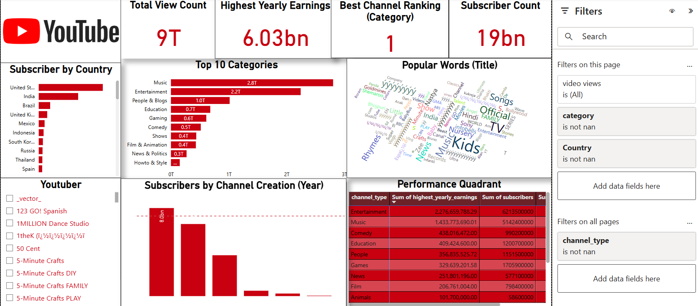

# YouTube Analytics Power BI Dashboard

&#x20;&#x20;

---

## Table of Contents

- [Overview](#overview)
- [Data Source](#data-source)
- [Project Structure](#project-structure)
- [Features](#features)
- [Installation & Usage](#installation--usage)
- [Report Structure](#report-structure)
- [Contributions](#contributions)
- [License](#license)
- [Contact](#contact)

---

## Overview

This Power BI project provides an interactive dashboard for analyzing global YouTube statistics for 2023. It enables users to explore trends, top-performing content, and other key insights related to YouTube performance.



---

## Data Source

The dataset used in this report is sourced from Kaggle: [Global YouTube Statistics 2023](https://www.kaggle.com/datasets/nelgiriyewithana/global-youtube-statistics-2023)

### Dataset Includes:

- Country-wise YouTube statistics
- Popularity metrics (views, likes, comments, shares)
- Channel performance indicators
- Video category breakdowns

---

## Project Structure

```
├── data/
│   ├── Global YouTube Statistics       #dataset from Kaggle
 
│
├── visuals/
│   ├── Youtube_Analytics.png  # Screenshot of the Power BI dashboard
│   ├── charts/                   # Folder for individual chart images
│
├── Youtube_Analytics.pbix   # Power BI project file
│
├── scripts/
│   ├── data_transformation_steps.txt  # Steps for data cleaning in Power BI
│   ├── DAX_formulas.txt               # DAX formulas used in the dashboard
│
├── README.md                # Documentation for the project
```

---

## Features

- **Interactive Visualizations:** Charts, graphs, and KPIs to track trends in YouTube content performance.
- **Country & Category Insights:** Analyze YouTube growth by region and video genre.
- **Engagement Metrics:** Monitor likes, comments, and shares to identify high-engagement content.
- **Top Channels & Videos:** Identify the most influential channels and viral videos of 2023.

---

## Installation & Usage

### Requirements

- Power BI Desktop (latest version)
- Internet connection (for external data refresh if needed)

### Steps to Use:

1. Download and install [Power BI Desktop](https://powerbi.microsoft.com/desktop/).
2. Clone this repository to your local machine:
   ```bash
   git clone https://github.com/your_username/your_repository_name.git
   ```
3. Download the `Youtube_Analytics.pbix` file from the repository.
4. Open the `.pbix` file in Power BI Desktop.
5. Refresh the data to ensure up-to-date analytics.
6. Explore the dashboard and interact with the visuals.

---

## Report Structure

- **Overview Page:** High-level insights and KPIs.
- **Country Breakdown:** Regional YouTube statistics.
- **Engagement Metrics:** Likes, comments, shares, and audience interaction.
- **Top Performers:** Leading YouTube channels and videos.
- **Trends & Predictions:** Visualization of content trends over time.

---

## Contributions

Feel free to contribute by improving visualizations, adding new metrics, or integrating additional data sources.

---

## License

This project is shared for educational and analytical purposes. Please credit the original dataset source if you use it in other projects.

---

## Contact

For any inquiries or suggestions, feel free to open an issue on this repository.

---

**Enjoy exploring YouTube trends with Power BI! 🚀**

